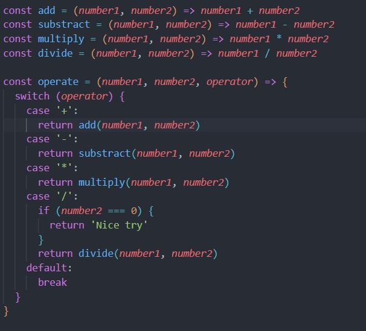
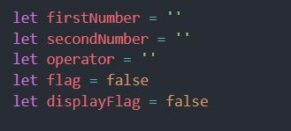
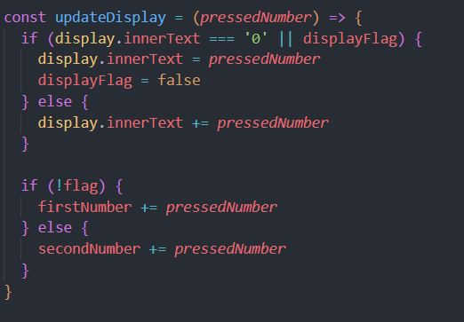
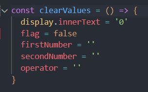
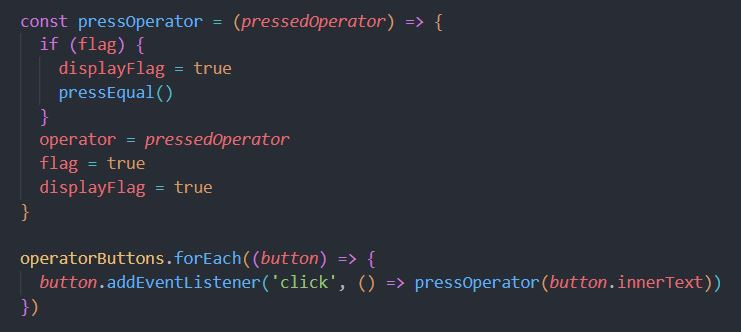
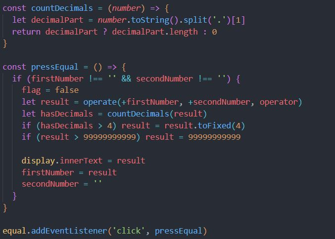

# Calculator

A JavaScript calculator. Last project of foundations section in TOP.

# What the project is about

This calculator project demonstrates basic arithmetic operations and includes functionality to handle decimal places and limit the displayed result within a specified range.

# What have I learned so far?

The calculator project has been instrumental in expanding my knowledge of web development and honing my skills in DOM manipulation. Here's an overview of the new concepts and techniques I've applied in this project in addition to what I've learned from past projects:

<ul>
  <li>Dynamic display updates with DOM manipulation.</li>
  <li>State management through the use of flags. </li>
</ul>

# Explanation of the code

The JavaScript code starts by defining four functions (add, subtract, multiply, and divide) to perform basic arithmetic operations on two numbers.
These functions are utilized in the operate function, which takes two numbers and an operator as parameters and returns the result of the corresponding operation.

The calculator maintains three key variables: firstNumber, secondNumber, and operator. These variables store the operands and the current operator for arithmetic operations. Additionally, flag and displayFlag are used to manage the state of the calculator during input.

The updateDisplay function handles user input, updating the display accordingly. It appends pressed numbers to the display and manages the state of the calculator based on user interactions.

The clearValues fuction's job is to reset the display to 0 and to reset all state variables to their original values.

The pressOperator function and the event listeners for operator buttons (operatorButtons) handle the activation of operators. When an operator is pressed, it triggers the pressOperator function, setting the operator and updating the calculator state.

The pressEqual function, triggered by the equal button, performs the calculation using the operate function, handles decimal places, and updates the display.

# Want to see it in action?

<a href="https://hroglardev.github.io/Calculator/" target="_blank">Click here</a>

# Want to track my progress?

Checkout my other projects in order to see my evolution:

<ol>
  <li><a href="https://github.com/hroglardev/odin-recipes" target="_blank">Recipes</a></li>
  <li><a href="https://github.com/hroglardev/Odin-landing-page" target="_blank">Landing Page</a></li>
  <li><a href="https://github.com/hroglardev/Rock-Paper-Scissors-TOP-Console" target="_blank">Console Rock, Paper, Scissors</a></li>
  <li><a href="https://github.com/hroglardev/Rock-Paper-Scissors-TOP" target="_blank">Rock, Paper, Scissors</a></li>
  <li><a href="https://github.com/hroglardev/Etch-a-Sketch" target="_blank">Etch a Sketch</a></li>
  <li><a href="https://github.com/hroglardev/Calculator" target="_blank">You are here</a></li>
  <li><a href="https://github.com/hroglardev/Sign-up-form-TOP" target="_blank">Sign up form</a></li>
  <li><a href="https://github.com/hroglardev/Dashboard" target="_blank">Dashboard</a></li>
  <li><a href="https://github.com/hroglardev/Library" target="_blank">Library</a></li>
</ol>
